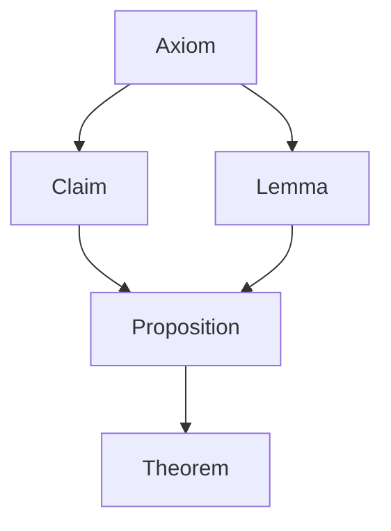

---
{"dg-publish":true,"permalink":"/proofs/"}
---

> [!TIP] Proof
> A valid argument that establishes the truth of a theorem. 
# The Building Blocks: Axioms 
Axioms are given **True** statements. Proofs are built on *axioms* and other theorems

- **Lemma**: less important theorems usually used to prove complicated theorems 
- **Corollary**: a theorem that is established directly from a theorem that has been proved
- **Conjecture**: a statement that is being proposed as true. Proving these makes theorems
## Other Useful Definitions 
- **Closure of multiplication in integers**: The product of two integers is an integer
- **Closure of addition in integers**: The sum of two integers is an integer
- The real number $r$ is rational if there exist integers $p$ and $q$ with $q \neq 0$  such that $r = \frac {p}{q}$.
# Format 
1. <u>Introduction</u>
	1. Declare your proof strategy
	2. List all assumptions 
2. <u>Body</u>: 
	1. Write the logical steps that yield our conclusion 
3. <u>Conclusion</u>: 
	1. "Therefore, by {your proof technique}, it hold that {the result you just proved}"

**What About Quantifiers??**
It's often the case the quants are omitted from proofs: 
> “If x > y, where x and y are positive real numbers, then x 2 > y 2 ” 
> *and  *
> "If x and y are positive real numbers and x > y, then x y > y 2"  
 > both mean  
> “For all positive real numbers x and y, if x > y, then x 2 > y 2  
# Direct Proofs 

> A direct proof of a conditional statement $p \rightarrow q$ is constructed when the first step is the assumption that $p$ is true; subsequent steps are constructed using rules of inference, with the final step showing that $q$  must also be true. A direct proof shows that when $p$ is true, $q$ must be true. ($p$ true  and $q$ false will never occur). 
## Prove"if  is an even integer, then  is also even" directly
We will proceed by direct proof. Assume $n$ is an even integer.

|                                |                                                                             |
| ------------------------------ | --------------------------------------------------------------------------- |
| 1. $n$ is even                 | given                                                                       |
| 2. $n = 2k$, $k$ is an integer | by the definition of even numbers                                           |
| 3. $n^2 = (2k)^2$              | squaring both sides of (2)                                                  |
| 4. $n^2 = 4k^2$                | expanding the right hand side of (3)                                        |
| 5. $n^2 = 2(2k^2)$             | factoring $4 = 2 * 2$ on the right hand side of (4)                         |
| 6. $n^2 = 2m$                  | set $m = 2k^2$, an integer because integers are closed under multiplication |
| 7. $n^2$ is even!              | by definition of even numbers                                               |                               |                                                                             |

Therefore, it follows using a direct proof that if $n$ is even, $n^2$ is also even ▋(add box to show end of theorem) 
# Contraposition

> We can proceed by contraposition ($\neg p \rightarrow \neg q$)or other ways of manipulating the original premise. 
## Let $n$ be an integer. Show that if $3n+2$ is even, then $n$ us also even*
We will proceed by contraposition. The contrapositive of the given statement is: If $n$ is odd, then $3n+2$ is odd. We assume $n$ is odd

|                                  |                                                      | 
| -------------------------------- | ---------------------------------------------------- | 
| 1. $n$ is odd                    | given                                                |   
| 2. $n = 2k + 1$, k is an integer | by the definition of odd numbers                     |     
| 3. $3n+2 = 3(2k + 1)+2$          | substitute the value of $n$ using (2)                | 
| 4. $3n+2 = 6k + 3 +2$            | distributing on the RHS of (2)                       |  
| 5. $3n+2 = 6k + 2 + 1 +2$        | using $3= 2+ 1$                                      |     
| 6. $3n+2 = 2(3k + 1 +1) + 1$     | factoring 2 out of $6k + 1 + 2$                      | 
| 7. $3n+2 = 2(3k+2) + 1$          | using $2=1+1$                                        |  
| 8. $3k+2 = m$ is an integer      | integers are closed under addition and multiplicaion | 
| 9. $3n+2 = 2m+1$                 | Plug in (8) in (7)                                   | 
| 10. $3n+2$ is odd!               | By definition of odd numbers                                                      |     |     |

Hence, the contrapositive of our given condition is True. We conclude, using a proof by contraposition, that if $3n+2$ is even, then $n$ is also even ▋
## Show that if $n^2$ is even, then n is also even*
We will proceed by contraposition. The contrapositive of the given statement is: If $n$ is odd, then $n^2$ is odd. Assume $n$ is an integer. 

|                                       |                                                     |
| ------------------------------------- | --------------------------------------------------- |
| 1. $n$ is odd                         | given                                               |
| 2. $n = 2k + 1$, $k$ is an integer    | by the definition of odd numbers                    |
| 3. $n^2 = (2k + 1)^2$                 | squaring both sides of (2)                          |
| 4. $n^2 = 4k^2 + 4k + 1$              | expanding the RHS of (3)                            |
| 5. $n^2 = 2(2k^2 + 2k) + 1$           | factor a 2 from the first two terms of (4)          |
| 6. $2k^2 + 2k = j$, $j$ is an integer | Integers are closed under addition & multiplication |
| 7. $n^2 = 2j + 1$                     | substitute (6) into (5)                             |
| 8. $n^2$ is odd                       | By definition of odd numbers and (7)                                                    |
# Contradiction 

> Assume $p$ is false! You aim to check $\neg p \rightarrow (q \land \neg q)$  so that $\neg (p \rightarrow q) \equiv \neg (\neg p \lor q) \equiv p \land \neg q$. 
## Show that if $5n + 2$ is odd, then $n$ is also odd, where $n$ is an integer.
We will proceed by contradiction. Assume $5n + 2$ is odd and $n$ is even. 

|                                      |                                                     |
| ------------------------------------ | --------------------------------------------------- |
| 1. $n$ is even                       | Given                                               |
| 2. $n = 2k$ for some $k$ integer     | definition for even numbers                         |
| 3. $5n + 2 = 5(2k) + 2$              | Using (2) in the expression $5n + 2$                |
| 4. $5n + 2 = 10k + 2$                | Expanding the RHS of (3)                            |
| 5. $5n + 2 = 2(5k + 1)$              | Factoring RHS of (4)                                |
| 6. $5k + 1 = j$ for some $j$ integer | Integers are closed under addition & multiplication |
| 7. $5n + 2 = 2j$                     | combining (5) and (6)                               |
| 8. $5n + 2$ is even                  | By definition of even numbers and (7)               |
| 9. $5n + 2$ is odd                   | Given                                                    |

Lines 8 and 9 yield a contradiction since an integer cannot be both odd and even. Thus, our assumption is false. We conclude "if $5n + 2$ is odd, then $n$ is odd" using a proof by contradiction ▋.

==Note==: Euler is the greatest mathematician of all time! 
Can you explain the giant fraction of irrational numbers you talked about in class? 
## Show that $\sqrt{2}$ is irrational* 
We will proceed by contradiction. Assume $\sqrt{2}$ is rational, this is $\sqrt{2} = \frac {p}{q}$ where $p$, $q$ are integers where $q \ne 0$, $p$ and $q$ share no factor. 

|                                                                |                                          |
| -------------------------------------------------------------- | ---------------------------------------- |
| 1.  $\sqrt{2}$ is rational                                     | Given.                                   |
| 2.  $\sqrt{2} = \frac {p}{q}$, $p$, $q$ are integers $q \ne 0$ | By definition of rational numbers        |
| 3.  $\sqrt{2}q = p$                                            | ...                                      |
| 4.  $2q^2 = p^2$                                               | squaring both sides of (2)               |
| 5.  $q^2 = j$ some integer                                     | Integers are closed under multiplication |
| 6.  $p^2 = 2j$                                                 | Combining (4) and (5)                    |
| 7.  $p^2$ is even                                              | from (6) and definition of even numbers  |
| 8.  $p$ is even                                                | Look at earlier example :D               |
| 9.  $p = 2a$ where $a$ is an integer                           | Def of even numbers and (8)              |
| 10. $2q^2 = (2a)^2$                                            | Combining (4) and (9)                    |
| 11. $2q^2 = 4a^2$                                              | Expanding RHS of (10)                    |
| 12. $q^2 = 2a^2$                                               | Simplifying (11)                         |
| 13. $q^2 = k$ for some integer $k$                             | Integers are closed under multiplication |
| 14. $q^2$ is even                                              | Def of even numbers and (14)             |
| 15. $q$ is also even                                           | Look at earlier example :D               |                                                               |                                          |

Lines (8) and (15) imply $p$ and $q$ has a factor of 2, which is false given our assumption
# Vacuous proof

> check that $p$ is False, and hence the conditional statement $p \rightarrow q$ is always true! This should be really simple. 
## Let $x \in \mathbb{R}$. If $x^2+1<0$, then $x^5 \geq 4$. 
Let us proceed directly. Note that $x \in \mathbb{R}$. Since $x \in \mathbb{R}$, $x^2$ is positive because the square of a real number is positive. Thus $x^2 >0$. This means $x^2<-1$ is false. We now see that the hypothesis to our conjecture is always false. Thus "If $x^2+1<0$, then $x^5 \geq 4$." is vacuously true when $x \in \mathbb{R}$. 
# Trivial Proof 

> check that $q$ is True, and hence the conditional statement $p \rightarrow q$ is always true! This should be really simple
## Let $x \in  \mathbb{R}$. If $x>0$, then $x^2+5>0$
Let us proceed directly. Let $x \in \mathbb{R}$. Then $x^2$ is positive since the square of a real number is positive. Thus $x^2 > 0$ and since $0> -5$, by transitivity $x^2 > -5$. By adding $5$ to both sides, we see that $x^2+5>0$ is always true. Thus "if $x>0$, then $x^2 +5>0$ is trivially true $\blacksquare$. 
# Backwards Reasoning 
When writing out a specific proof, it might be easier to start off at the end and work your way, backwards, to the start. 
# Exhaustive Proofs 

> Try every possibility of the proposition. If all cases are proven true, then the proposition is proven. 
## Prove that $(n+1)^3 \geq 4^n$ if $n$ is a positive integer with $n \leq 3$
Let us use proof by exhaustion. Let $P(n)$ be $(n+1)^3 \geq 4^n$. 
- $P(1)$ is true because $(n+1)^3 = (1+1)^3 = 2^3 = 8$ and $4^n = 4^1 = 4$. We see that $8 \geq 4$ Thus $P(1)$ is true. 
Thus by exhausting $P(n)$ is true whenever $n$ is a positive integer less than or equal to 3 $\blacksquare$. 
# WLOG Proofs 

> Sometimes, we can eliminate cases in proofs when the cases are very  
> similar.  For example, if we had a case where $x >0$ and $y< 0$ and a separate case  
> where $x <0$ and $y>0$ where $x$, $y$ are both real numbers
## *Show that if $x$ is even or $y$ is even, then $sy$ is even*
Assuming $x$ is even is general enough to make a conclusion. 
We will proceed by direct proof. Assume Without Loss of Generality, $x$ is even. 

|                                |                                                  |
| ------------------------------ | ------------------------------------------------ |
| 1. $x$ is even                 | given                                            |
| 2. $x = 2k$, k is some integer | by definition of even numbers                    |
| 3. $xy = 2ky$                  | subsitution using (2) on the multiplication $ky$ |
| 4. $ky = 2$, 2 is an integer   | integers are closed under multiplication         |
| 5. $xy = 2k$                   |  Using (4) and (3)                                                |
| 6. $xy$ is even                | by definition of even numbers and (5)                                                 |

Hence, by a direct proof, we can conclude that "If $x$ is even or $y$ is even, then $xy$ is even" ▋. 
# Corollary 

> **Corollary**: a proposition that follows from (and is often appended to) one already proved.

Corollary: If $x$ is even, then $x^2$ is even 
Corollary: If $x$ is even, then $x^n$ is even. Here, $n$ is a natural number bigger than 0. 
- "bigger than 0" because this class assumes 0 is in natural numbers
## *If $x$ is odd, then $x$ is odd.*
- contrapositive: if $x$ is even then $x^n$ is even
- Corollary $x$ is even / odd IF AND ONLY IF $x^n$ is even / odd

