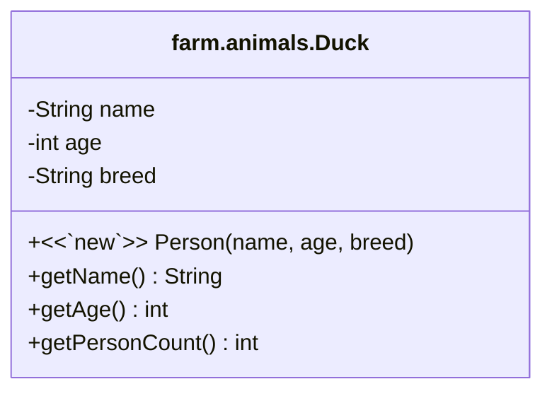

---
{"dg-publish":true,"permalink":"/uml-class-diagrams/"}
---

The *Unified Modeling Language* Class Diagram is the most common modeling diagram that shows the contents of a class how classes can interact with each other. Note, this page are notes from [here](implements).  
# Tour de Map 

1. **Visibility**: Visibilities facilitate **access control**, by telling the compiler the set of locations allowed to access that element. 

| Visibility Name | Keyword     | UML Symbol | Top-Level | Member-Level | Local-Level |
| --------------- | ----------- | ---------- | --------- | ------------ | ----------- |
| private         | `private`   | -          | x         | ✓            | x           |
| package private |             | ~          | ✓         | ✓            | x           |
| protected       | `protected` | #          | x         | ✓            | x           |
| public          | `public`    | +          | ✓         | ✓            | x            |
A side note: derived (`/`) means an attribute can be computed (such as the `area` from the `length` + `width`)

2. **Class Name**: the first block is the FQN, but sometimes the simple name of the class can be used 

3. **Variables** (aka Attributes): this is the second block representing the instance variables. The visibility modifier (the first symbol) is followed by the data type and then the name of the variable.

4. **Methods** (aka Operations): this is the 3rd block, consisting of constructors, instance methods and static methods. It's formatted as such`visibility [<<stereotype>>] methodName(param1: type, param2: type): returnType`. 

For certain methods follow these protocols

| Name            | UML Symbol             |
| --------------- | ---------------------- |
| static | <u>underlined text</u> |
| abstract        | *italicized text*                       | 

Stereotypes are optional "comments" that you can use to convey more info. 

| Name            | Description         |
| --------------- | ------------------- |
| `<<new>>`       | denotes constructor |
| `<<abstract>>`  | dentores abstract   |
| `<<override>>`  | denotes override    |
| `<<interface>>` | denotes interface   |
| `<<final>>`     | denotes final                    |

## (Exclusive?) Memberships
Depending on where something is declared, there is a different level of "visibility" the term has, aside from the visibility modifiers.  
- **top-level declaration** the outermost declaration in `.java` files (ie classes + interfaces)
- **member-level declaration** any declaration of a class or interface member (ie constructors, methods, variables, constants, etc) and NO LOCAL-LEVEL declarations 
- **local-level declaration** any variable declaration that's local to a particular method, including the parameter and any variables declared within the body 

Here's an example: 
```java
public class Doggo { // <------------- `Doggo` is top-level
    private String name; // <---------- `name` is member-level
    public Doggo(String name) { // <-- `Doggo` is member-level; `name` is local-level
        int age = 0; // <--------------- `age` is local-level
        this.name = name;
    } 
} 
```

## Public vs Private 
the `public` modifier allows things to be visible in the same class, package, child class, and elsewhere. The `private` modifier allows things to be visible in the same class, but not the same package, child class and elsewhere.  (What do you mean by the -`public` or `-private` options in the javadoc comments? -> pulls all items with that specific modifier; default behavior is public)
## Protected vs Package Private
the `protected` visibility allows things to be visible in the same class, package, child, but not elsewhere. the `package private` visibility is a default visibility for elements are only visible inside a package
## Associations 
As the diagrams start to get more complicated and connect with other classes, we can show these associations (particularly [[Inheritance\|Inheritance]] and [[Interfaces\|Interfaces]] ). 

| Association                          | Description                              | Usage                              |
| ------------------------------------ | ---------------------------------------- | ---------------------------------- |
|  | solid line; open arrowhead               | classA uses ClassB                 |
|  | solid line; unfilled triangle arrowhead  | child extends parent               |
|  | dashed line; unfilled triangle arrowhead | `someclass` implements `someinterface` |                                                                            |                                    |

Source : reading on UML diagrams 
# A bigger picture 
Let's dive into a more complex picture with some of the other features mentioned above (but not shown in the initial UML class diagram). 